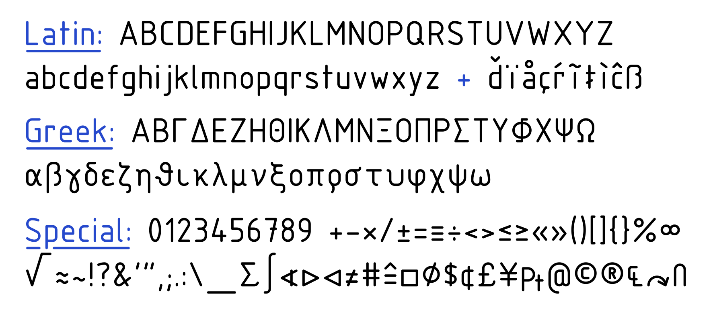
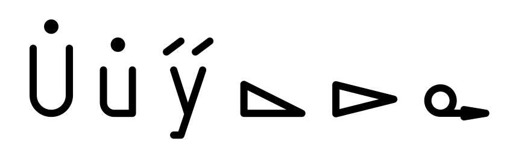

# NormStroke

This single-stroke font is derived from [this SVG on Wikimedia Commons](https://commons.wikimedia.org/wiki/File:ISO3098.svg) with ISO 3098 Type B Lettering.
All characters were automatically extracted from this SVG and converted into an SVG font that can be used for example with the [Hershey-Text](https://wiki.evilmadscientist.com/Hershey_Text)
plugin for [Inkscape](https://inkscape.org/).

There are also versions available that are converted into TrueType, OpenType and UFO using [FontForge](https://fontforge.org/). For TrueType/OpenType, contours are always closed. These files are therefore slightly modified ("pseudoclosed"), so that the endpoints of intentionally closed contours are minimally shifted apart. This way they can be used in software that allows to remove closing segments while still appearing visually closed when used with a finite stroke width.

Included are all a total of 323 characters plus space. The following characters from the above SVG are not part of this first version, as I couldn't find the corresponding Unicode codepoints or they can only be represented using combining diacritic marks:

The digit `7` uses the style with a dash. Additionally added is a design for the asterisk `*` to support the complete printable ASCII set.

## Usage Notes
For the correct stroke width when using Hershey-Text in Inkscape, set the stroke width to 0.08 times the font size before conversion (i.e. 1.6pt if the text object was 20pt).
Details about spacing are given [in this Wikibooks page](https://de.wikibooks.org/wiki/Technisches_Zeichnen/_Linien_und_Beschriftung) (unfortunately only in German).

## Design Notes
The glyph SVGs appear upside down because SVG fonts have an inverted y-axis (Search for "y-axis" in the [specification](https://www.w3.org/TR/SVG11/fonts.html#SVGFontsOverview)).

## License
This work is marked with CC0 1.0. To view a copy of this license, visit https://creativecommons.org/publicdomain/zero/1.0/
